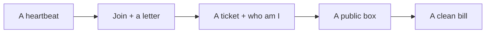

# The door is yours

A club needed a door. We built it in TypeScript, remembered people in Neon, mailed proof through SES, then put Ubuntu behind Nginx — often just **`http://PUBLIC_IP`**, a domain only if you have one — and we tear it down so the bill stays boring.

The frontend consumes the contract. RAG fills grounded answers later. Our job was this layer: boring, correct, shippable — and something you can actually turn off.

Go build the rest of the club.
