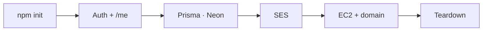

# Close

One path: TypeScript API, Prisma on Neon, SES mail, Ubuntu behind a domain — then a clean bill.

The frontend consumes the contract. RAG fills grounded answers. This layer stays correct, deployable, and disposable.
